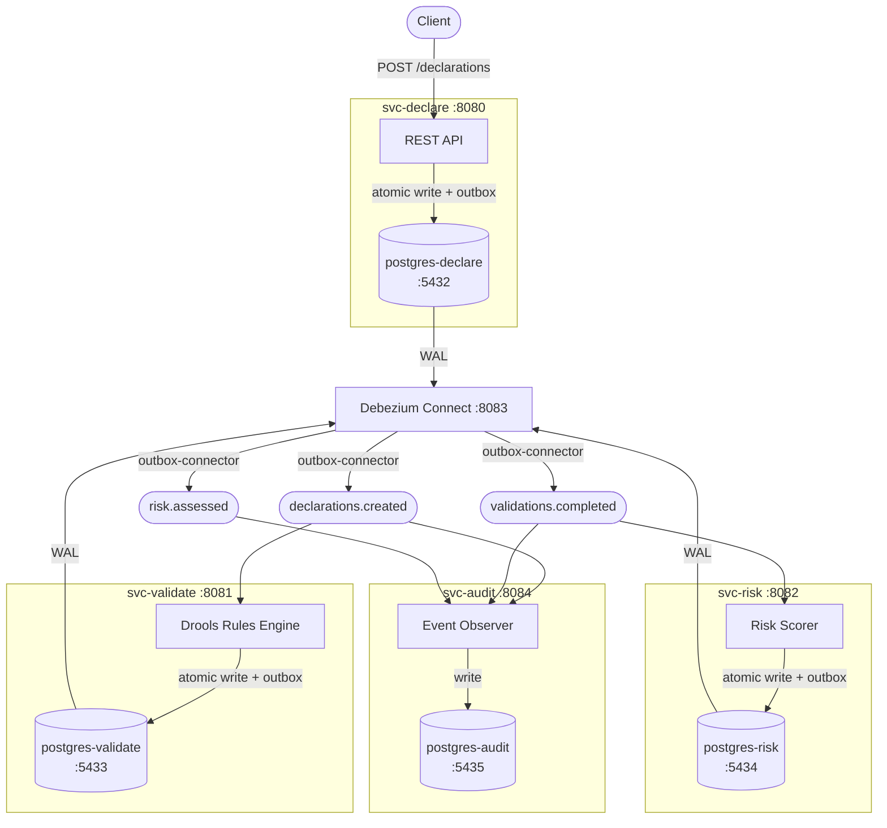

# System Architecture

## Key

| Symbol | Meaning |
|--------|---------|
| Rectangle | Service or component |
| Cylinder | PostgreSQL database |
| Stadium | Kafka topic |
| `WAL` edge | Debezium reads PostgreSQL Write-Ahead Log via logical replication |
| `outbox-connector` edge | Debezium Outbox EventRouter SMT publishes rows to Kafka |
| `atomic write + outbox` | Business record and outbox row written in a single DB transaction |
